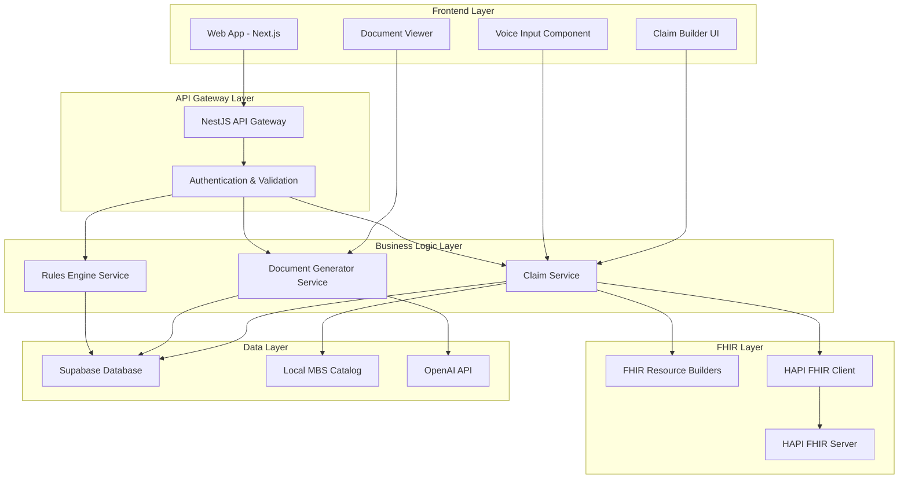
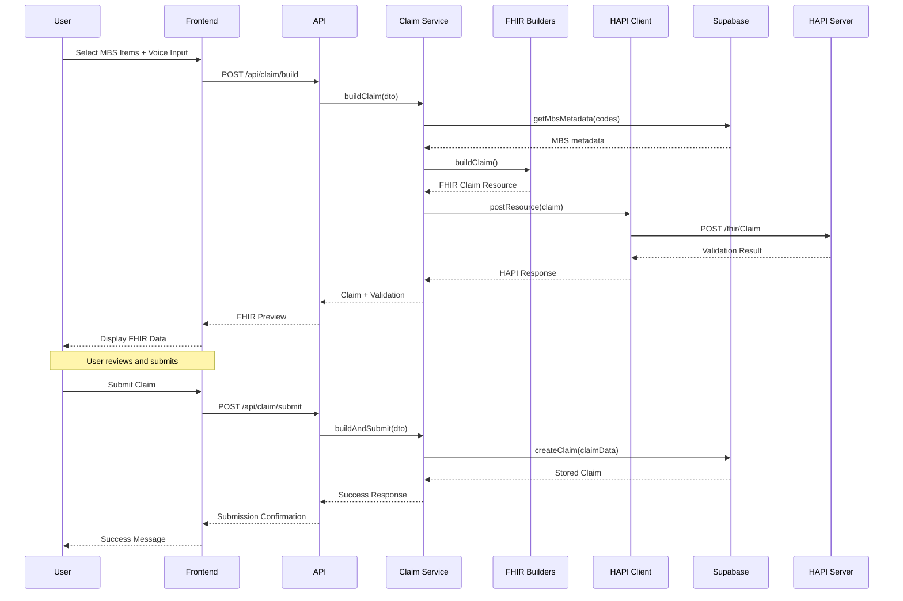
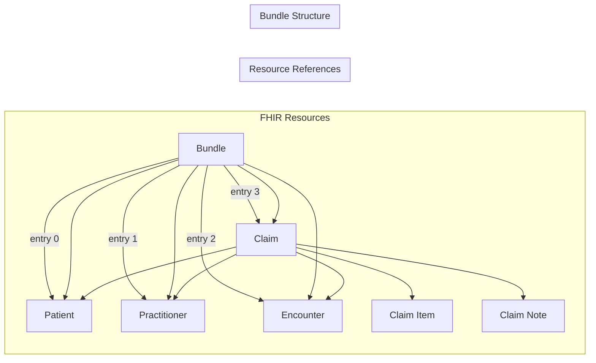
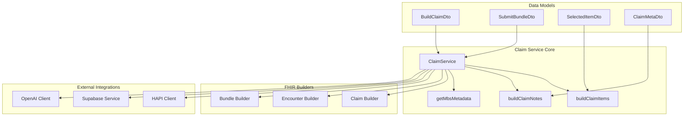
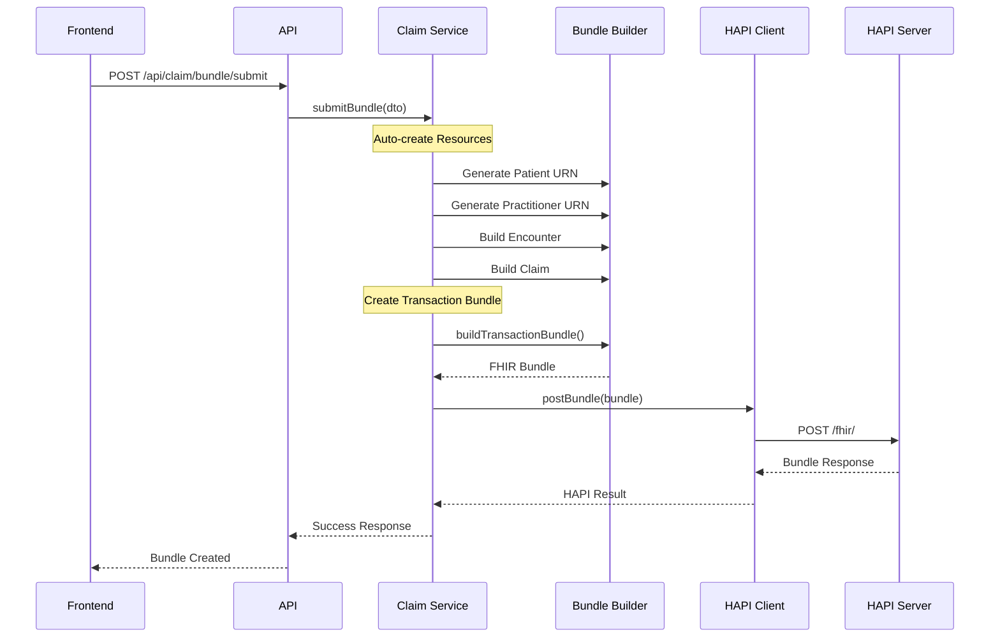
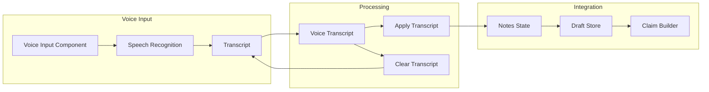
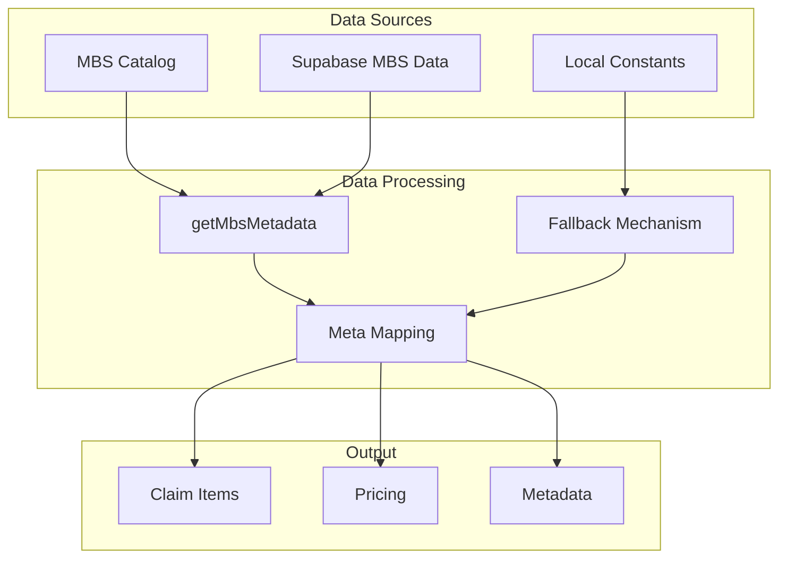
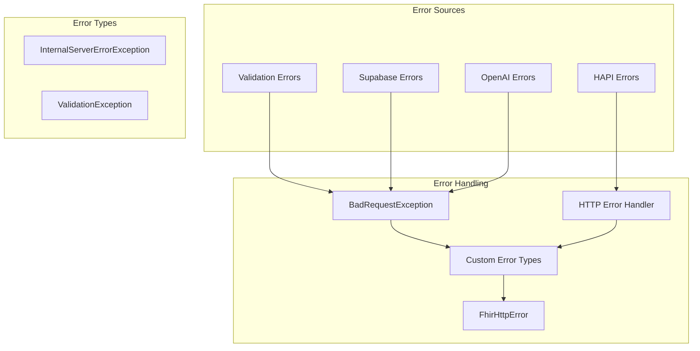
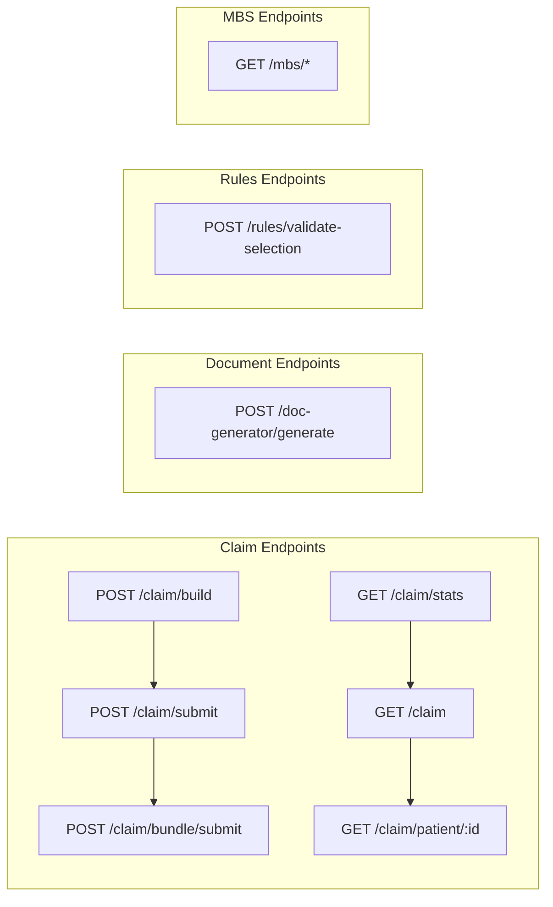
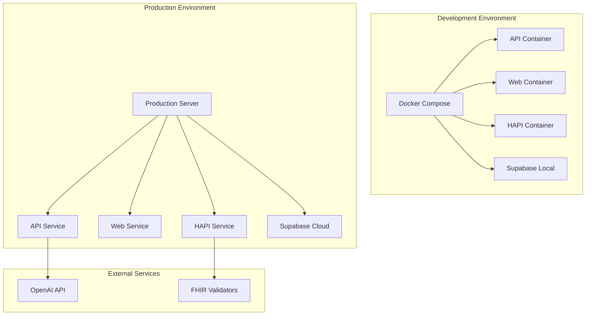

# MBS Pro Technical Documentation

## Project Overview

MBS Pro is a FHIR-standard-based Australian Medicare Benefits Schedule (MBS) management system that provides comprehensive functionality for medical claim creation, validation, submission, and related document generation.

## Core Functional Modules

### 1. Claim Backend Service Architecture

#### 1.1 Module Structure

```
apps/api/src/claim/
├── claim.module.ts          # NestJS module definition
├── claim.controller.ts      # REST API controller
├── claim.service.ts         # Business logic service
├── hapi.client.ts          # HAPI FHIR client
├── fhir/                   # FHIR resource builders
│   ├── claim.builder.ts    # Claim resource builder
│   ├── encounter.builder.ts # Encounter resource builder
│   └── bundle.builder.ts   # Bundle resource builder
└── dto/                    # Data transfer objects
    ├── build-claim.dto.ts  # Build claim request
    └── submit-bundle.dto.ts # Submit bundle request
```

#### 1.2 Core Service Functions

**ClaimService** provides the following main functions:

- **buildClaim()**: Builds a single FHIR Claim resource (preview mode)
- **buildAndSubmit()**: Builds and submits a single Claim (requires frontend to provide encounterId)
- **submitBundle()**: Automatically creates Encounter + Claim transaction bundle
- **getClaimsStats()**: Retrieves claim statistics
- **getAllClaims()**: Retrieves all claim records
- **getPatientClaims()**: Retrieves claims for a specific patient

#### 1.3 FHIR Resource Building

**Claim Builder** supports:

- MBS code mapping and metadata retrieval
- Price calculation and currency handling
- Modifiers support
- Clinical notes integration
- Status management and priority settings

**Encounter Builder** supports:

- Patient and practitioner reference management
- Visit type and time settings
- Service category classification

**Bundle Builder** supports:

- Transactional bundle creation
- Resource references and URN generation
- Batch operation support

### 2. HAPI FHIR Integration

#### 2.1 Client Architecture

**HAPI Client** (`hapi.client.ts`) provides:

```typescript
// Core functions
export async function postResource(resource: any); // Submit single FHIR resource
export async function postBundle(bundle: any); // Submit bundle
export async function getClaims(params: Record<string, string>); // Get claims
export async function getClaimsByPatient(patientId: string); // Get claims by patient
export async function getMetadata(); // Get FHIR metadata
```

#### 2.2 Features

- **Timeout Control**: 20-second request timeout
- **Error Handling**: Structured FHIR error responses
- **Content Type Validation**: Ensures FHIR+JSON format
- **Redirect Support**: Automatic redirect following
- **Batch Operations**: Supports transaction and batch bundles

#### 2.3 Configuration

```typescript
const BASE = (process.env.HAPI_BASE || "http://localhost:8081/fhir").replace(
  /\/$/,
  ""
);
```

Supports environment variable configuration for HAPI server address.

### 3. Frontend Claim Builder Integration

#### 3.1 Page Architecture

**Claim Builder Page** (`apps/web/src/app/claim-builder/page.tsx`) provides:

- **Patient and Practitioner Selection**: Retrieves data from Supabase
- **Claim Item Management**: Displays selected MBS items
- **Compliance Checking**: Real-time claim compliance validation
- **FHIR Preview**: Real-time FHIR data preview generation
- **Document Generation**: Supports referral letters and care plans

#### 3.2 State Management

Uses Zustand for global state management:

```typescript
// Claim draft state
const { draft, clear } = useClaimDraft();

// Contains:
// - selected: MBS item selections
// - notes: Clinical notes
// - quickRules: Quick rule validation results
// - meta: Metadata information
```

#### 3.3 Real-time FHIR Generation

```typescript
// Automatically generate FHIR data
useEffect(() => {
  if (selectedPatient && selectedProvider && claimItems.length > 0) {
    fetchFhirData();
  }
}, [selectedPatient, selectedProvider, draft.selected.length]);
```

Automatically calls backend API to generate FHIR data when dependencies change.

#### 3.4 Compliance Check Panel

Displays:

- Documentation completeness checks
- Time interval validation
- Clinical indicator validation
- Patient demographic validation

### 4. Speech-to-Text Functionality

#### 4.1 Implementation

Uses Web Speech API's `webkitSpeechRecognition`:

```typescript
// Initialize speech recognition
useEffect(() => {
  if (typeof window !== "undefined" && "webkitSpeechRecognition" in window) {
    const SpeechRecognition = (window as any).webkitSpeechRecognition;
    const recognition = new SpeechRecognition();

    recognition.continuous = true; // Continuous recognition
    recognition.interimResults = true; // Real-time results
    recognition.lang = "en-AU"; // Australian English
  }
}, []);
```

#### 4.2 Functional Features

- **Continuous Recording**: Supports long-duration voice input
- **Real-time Transcription**: Displays intermediate results
- **Language Support**: Australian English optimization
- **Error Handling**: Graceful error handling and state management
- **Transcription Application**: One-click application of voice transcription to clinical notes

#### 4.3 User Interface

- Recording button (🎤)
- Real-time transcription display
- Transcription apply/clear buttons
- Recording status indicator

### 5. Document Generation Service

#### 5.1 Supported Document Types

- **Referral Letter**: Professional medical referral letters
- **Care Plan**: GP management plans

#### 5.2 Technical Implementation

Uses OpenAI API for intelligent document generation:

```typescript
// Document generation workflow
1. Retrieve patient and practitioner data from Supabase
2. Build structured prompts
3. Call OpenAI API (GPT-4o-mini)
4. Return structured JSON responses
5. Support Markdown format output
```

#### 5.3 Prompt Engineering

- **Australian Medical Standards**: Follows RACGP and Services Australia standards
- **Structured Output**: JSON Schema validation
- **Data Integrity**: Missing data marked as "Not provided"
- **Professional Style**: Clinical professional document style

### 6. Data Persistence

#### 6.1 Supabase Integration

- **Patient Management**: `mbs_patients` table
- **Practitioner Management**: `mbs_practitioners` table
- **Claim Records**: `claims` table
- **Organization Management**: `mbs_organizations` table

#### 6.2 Data Synchronization

- Local MBS catalog as fallback
- Prioritizes Supabase metadata
- Falls back to local constants on failure

### 7. API Endpoints

#### 7.1 Claim-related Endpoints

```
POST /api/claim/build          # Build claim (preview)
POST /api/claim/submit         # Build and submit single claim
POST /api/claim/bundle/submit  # Submit bundle (auto-create encounter)
GET  /api/claim/stats          # Get statistics
GET  /api/claim                # Get all claims
GET  /api/claim/patient/:id    # Get patient-specific claims
```

#### 7.2 Document Generation Endpoints

```
POST /api/doc-generator/generate  # Generate medical documents
```

### 8. Error Handling and Validation

#### 8.1 Input Validation

- DTO validation
- Business rule validation
- FHIR format validation

#### 8.2 Error Types

- `BadRequestException`: Client errors
- `InternalServerErrorException`: Server errors
- `FhirHttpError`: FHIR-related errors

### 9. Deployment and Configuration

#### 9.1 Environment Variables

```bash
HAPI_BASE=http://localhost:8081/fhir
OPENAI_API_KEY=your_openai_key
OPENAI_CHAT_MODEL=gpt-4o-mini
```

#### 9.2 Docker Support

Project includes `docker-compose.yml` for local development environment.

### 10. Testing and Validation

#### 10.1 Test Coverage

- Unit Testing: Jest
- E2E Testing: Playwright
- API Testing: Integration tests

#### 10.2 Validation Workflow

1. **Frontend Validation**: User input validation
2. **API Validation**: DTO and business rule validation
3. **FHIR Validation**: HAPI server validation
4. **Data Persistence**: Supabase storage validation

## Technology Stack Summary

- **Backend**: NestJS, TypeScript, FHIR
- **Frontend**: Next.js, React, TypeScript, Tailwind CSS
- **Database**: Supabase (PostgreSQL)
- **FHIR Server**: HAPI FHIR
- **AI Services**: OpenAI GPT-4o-mini
- **State Management**: Zustand
- **Speech Recognition**: Web Speech API
- **Deployment**: Docker, Docker Compose

## Development Highlights

1. **Complete FHIR Integration**: End-to-end workflow from resource building to server validation
2. **Real-time Voice Input**: Improves practitioner input efficiency
3. **Intelligent Document Generation**: AI-driven medical document generation
4. **Compliance Checking**: Real-time MBS rule validation
5. **Modular Architecture**: Clear code organization and responsibility separation
6. **Error Handling**: Comprehensive error handling and user feedback
7. **Responsive Design**: Modern user interface

# MBS Pro Claim System Architecture Diagrams

## 1. High-Level System Architecture



## 2. Claim Processing Data Flow



## 3. FHIR Resource Relationship Diagram



## 4. Detailed Claim Service Architecture



## 5. Bundle Submission Flow



## 6. Voice-to-Text Integration



## 7. MBS Data Flow Architecture



## 8. Error Handling Architecture



## 9. API Endpoint Architecture



## 10. Deployment Architecture



## Key Technical Components

### FHIR Resource Builders

- **Claim Builder**: Creates FHIR Claim resources with MBS codes
- **Encounter Builder**: Generates Encounter resources for patient visits
- **Bundle Builder**: Assembles transaction bundles for batch operations

### Data Flow Patterns

1. **Single Claim Flow**: Direct claim creation with existing encounter
2. **Bundle Flow**: Automatic encounter + claim creation in single transaction
3. **Preview Flow**: FHIR generation without persistence
4. **Validation Flow**: HAPI server validation with fallback

### Integration Points

- **HAPI FHIR Server**: FHIR compliance validation
- **Supabase**: Patient, practitioner, and claim data persistence
- **OpenAI**: Intelligent document generation
- **Web Speech API**: Voice-to-text functionality

### Error Handling Strategy

- **Graceful Degradation**: Local fallbacks when external services fail
- **Structured Errors**: FHIR-compliant error responses
- **User Feedback**: Clear error messages and recovery suggestions

### Performance Optimizations

- **Lazy Loading**: FHIR data generation on demand
- **Caching**: MBS metadata caching in Supabase
- **Batch Operations**: Transaction bundles for multiple resources
- **Async Processing**: Non-blocking voice recognition and document generation

